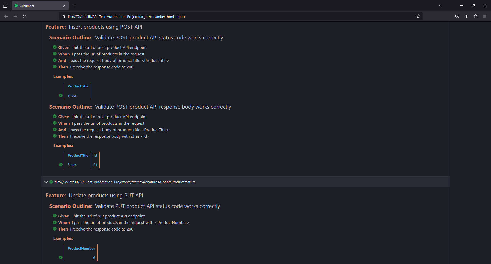

<h1 align="center">API Test Automation</h1>  

  This is an API Test Automation project built using Java with Cucumber BDD framework. Automated four Features with seven Scenarios. Used Postman for initial manual testing.

---

  Cucumber | Postman | Java | Maven

---

### Screenshot:

 

### Test Report:

 

